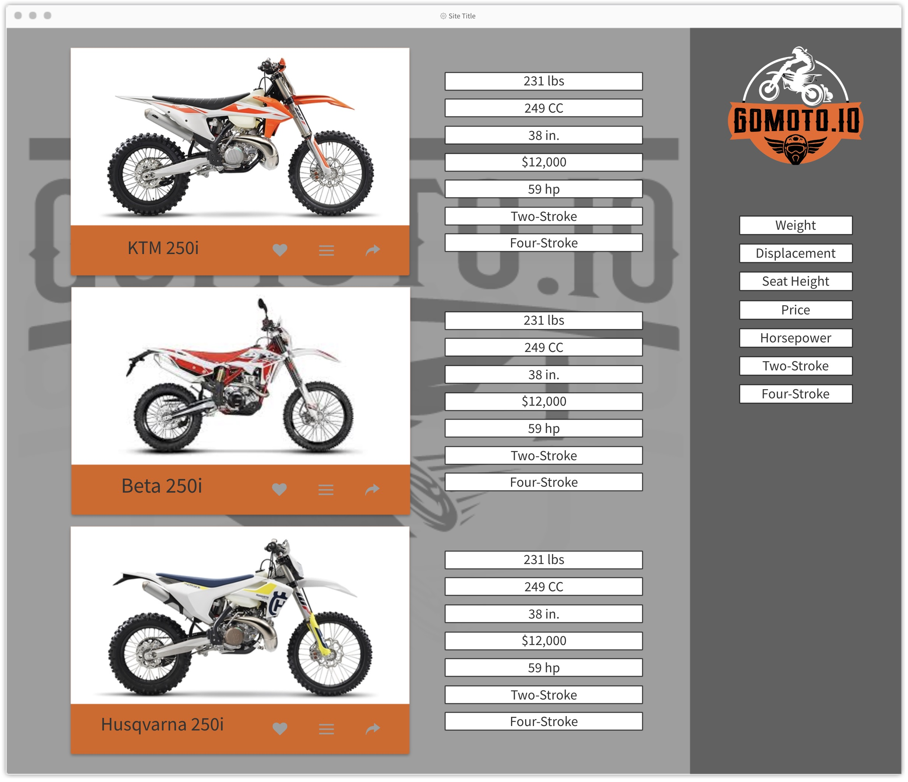

# GoMoto.io Capstone Proposal
## By *Shane Cheek*
### Project Overview

**GoMoto.io** is a way to quickly assess and sort dirt bikes according to what aspects you care about most. **GoMoto** takes your weighted inputs for characteristics of dirt bikes that you have weighted as higher importance; compares and prioritizes these characteristics, then sorts and displays the dirt bikes in the order that's best for you.

My aim is to create an easy way to compare dirt bikes and make a decision on which one a user should get by consolidating data, allow the user to weight the most common properties based on their preference, and then wrap that in a simple visual and easy to use interface.

- #### Sketch:
    

Features:
- #### **GoMoto.io** - Milestone 1:
    - Minimalistic user interface (HTML/ CSS)
    - Simplistic input interface (sliders for input weights) (HTML/ CSS)
    - Take the user inputs using a drag and drop interface and the output will present the top 3 dirt bikes to the user (Django, Python, VUE, Javascript)
    - Deploy to gomoto.io
#
# Motorcycle Registration Form:
## Mini project!
### Create a registration for for the local motorcycle dirt bike club
- #### Registration - Milestone 1:
    - Create a form for events that takes user info and stores it in a database
        - The will be prefaced by a selection drop-down.
        - After selecting the event and the same view will display that events registration form
    ###### !!! This should be the only thing I need to complete !!!
    ###### else:
    
- #### Registration - Milestone 2:
    - Figure out accessibility at the event... TBD (Maybe a downloadable CSV?)
     
- #### Registration - Milestone 3:
    - Payment processing
        
- #### Registration - Milestone 4:
    - Create a user login and pre-populate out the form they select with their latest information.
#
# Back to the cool stuff
- #### **GoMoto.io** - Milestone 2:
    - User accounts (Django)
    - Save favorite dirt bikes (Django)
    
- #### **GoMoto.io** - Milestone 3:
    - Manufacturing brand filtering (Django)
    
###### *Not sure about the milestone 4 feature:*
- #### **GoMoto.io** - Milestone 4:
    - Compare favorite dirt bike specifications (JS, Django)
#

## Libraries:
#### CSS:
- https://materializecss.com/
- https://bulma.io/
- https://www.google.com/recaptcha/intro/v3beta.html

####Frameworks:
- Django
- VUE
#
## Functionality
### Features:
#### **GoMoto.io** - Milestone 1:
###### Milestone 2 to be updated as milestone 1 nears completion...
- ##### Minimalistic user interface
    - This will be a single page application. At this stage (milestone 1) the index page will only have a background and 5-7 prioritization drag and drop buttons and maybe some instructions
- ##### Simplistic input interface
    - User will be presented with only 4-7 drag and drop properties
- ##### Take the user inputs using a drag and drop interface and the output will present the top 3 dirt bikes to the user
    - As the user drags properties into a prioritized list, they will start to see the top 3 dirt bikes on the page based on the order they have the priorities (top to bottom: Top being the highest weight and the bottom being the lowest). This will be done through AJAX calls...

### Data Model
- ##### Stored Data
    - I will have to scrape data from DIRTRIDER.COM's buyer search pages. The data I'm looking for will be, but not limited to:
    - Table 1 = Bike:
        - ###### Horsepower
        - ###### Dry Weight
        - ###### Power to weight ratio
        - ###### seat height
        - ###### Fuel Type (2-stroke or 4-stroke)
        - ###### Displacement
        - ###### Price
    - Table 2 would be User if the milestone is met.

## Schedule
#### **GoMoto.io** - Milestone 1:
- Should be complete within 2 weeks of the start date (roughly July, Wed. 18th)
#### Registration - Milestone 1:
- Should be complete within 1 week of the start date (roughly July, Wed. 25th)
#### Remaining Time:
- The following week would be dedicated to instantiating a User table, login and saving their favorite dirt bikes
#### Post Grad:
- I will continue to work on the Registration form for the motorcycle club and build out the dirt bike data base, as the data pulled from DIRTRIDER.COM is not complete for the newest year dirt bikes.

